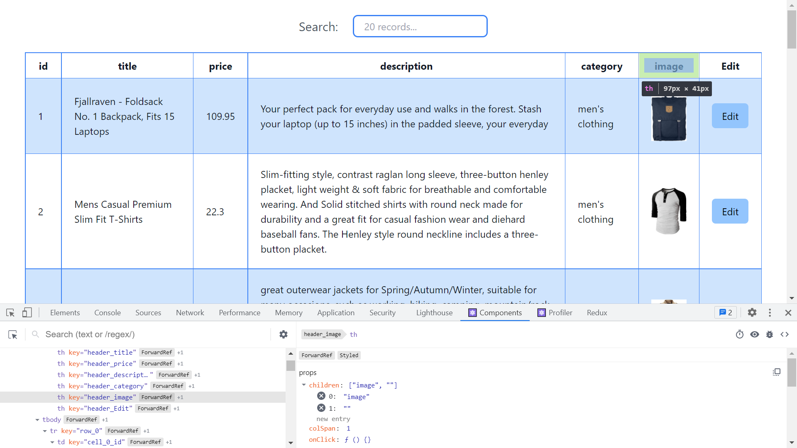

# :zap: React Tailwind Tables

* A React app to display tables
* **Note:** to open web links in a new window use: _ctrl+click on link_


## :page_facing_up: Table of contents

* [:zap: React Tailwind Tables](#zap-react-tailwind-tables)
  * [:page_facing_up: Table of contents](#page_facing_up-table-of-contents)
  * [:books: General Info](#books-general-info)
  * [:camera: Screenshots](#camera-screenshots)
  * [:signal_strength: Technologies](#signal_strength-technologies)
  * [:floppy_disk: Setup](#floppy_disk-setup)
  * [:computer: Code Examples](#computer-code-examples)
  * [:clipboard: Status & To-Do List](#clipboard-status--to-do-list)
  * [:clap: Inspiration](#clap-inspiration)
  * [:file_folder: License](#file_folder-license)
  * [:envelope: Contact](#envelope-contact)

## :books: General Info

* React
* Tailwind CSS added to Next.js

## :camera: Screenshots



## :signal_strength: Technologies

* [React v17](https://reactjs.org/) Javascript library.
* [Tailwind v2](https://tailwindcss.com/) utility-first CSS framework
* [PostCSS v8](https://postcss.org/) tool for transforming CSS with JavaScript
* [react-table](https://yarnpkg.com/package/react-table) Hooks for building lightweight, fast and extendable datagrids for React
* [axios](https://yarnpkg.com/package/axios) Promise based HTTP client for the browser and node.js

## :floppy_disk: Setup

* `npm run dev` runs the app in the development mode. Open [http://localhost:3000](http://localhost:3000) to view it in the browser.
* `npm run build` builds the app for production to the `build` folder. It correctly bundles React in production mode and optimizes the build for the best performance. The build is minified and the filenames include the hashes.
* `npm run start` to run the built app.

## :computer: Code Examples

* tba

```javascript

```

## :clipboard: Status & To-Do List

* Status: In work
* To-Do: Complete

## :clap: Inspiration
* [React Table Quick Start](https://react-table.tanstack.com/docs/quick-start)


## :file_folder: License

* N/A

## :envelope: Contact

* Repo created by [ABateman](https://github.com/AndrewJBateman), email: gomezbateman@yahoo.com